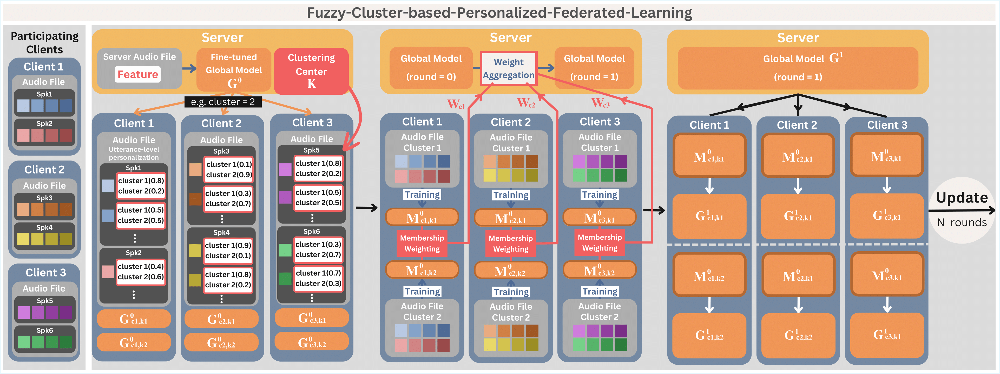

# Fuzzy Cluster-Based Personalized Federated Learning (FCPFL)



This repository contains the implementation of "Personalized Federated Learning with Fuzzy Clustering for Dysarthric Speech Recognition" - a novel approach that uses Fuzzy C-means clustering in federated learning to handle pathological speech recognition.

## ⚠️ Important: Dataset Configuration Required

**This repository has been cleaned to remove all dataset-specific information. You MUST configure the paths and parameters for your own pathological speech dataset before running the code.**

## 🔧 Required Configurations

### 1. Dataset Paths and Structure

The following files contain `# TODO: UPDATE THIS PATH` comments that need to be updated:

#### In `feature_selection_multi_ADReSS_cleaned.py`:
- `--audio_dir`: Path to your audio files directory
- `--train_csv`: Path to your training CSV file
- `--model_path`: Path to your pre-trained model
- `client_spks`: List of speaker IDs in your dataset

#### In `federated_main_cleaned.py`:
- `CPFL_dataRoot`: Root directory for your dataset
- Speaker lists in `train_split_supervised()` function

#### In `options_cleaned.py`:
- `--model_in_path`: Input model directory
- `--model_out_path`: Output model directory
- `--Kmeans_model_path`: K-means model save path
- `--dataset_path_root`: Dataset root directory

#### In `update_CPFL_cleaned.py`:
- `CPFL_codeRoot`: Code root directory
- `CPFL_dataRoot`: Data root directory
- `score_file`: Path to clinical scores file

#### In `utils_cleaned.py`:
- `CPFL_codeRoot`: Code root directory
- `CPFL_dataRoot`: Data root directory
- `--root_dir`: Root directory for audio files
- `path2_dict`: Path to speaker-to-label dictionary
- `client2spk()`: Speaker ID mappings
- Speaker lists in `train_split_supervised()`

### 2. Dataset Format Requirements

Your dataset should follow this structure:

```
dataset/
├── audio_clips/
│   ├── SPEAKER_001_TYPE_001.wav
│   ├── SPEAKER_001_TYPE_002.wav
│   └── ...
├── train.csv
├── test.csv
├── clinical_scores.txt
└── label_dict.npy
```

#### CSV Format (train.csv, test.csv):
```csv
spk,path,sentence
SPEAKER_001,SPEAKER_001_TYPE_001.wav,"The quick brown fox"
SPEAKER_002,SPEAKER_002_TYPE_001.wav,"Jumps over the lazy dog"
```

#### Clinical Scores Format (clinical_scores.txt):
```
ID;score
SPEAKER_001;25.5
SPEAKER_002;28.0
```

#### Label Dictionary (label_dict.npy):
```python
# Python dictionary mapping speaker IDs to class labels
{
    'SPEAKER_001': 0,  # Class 0 (e.g., healthy control)
    'SPEAKER_002': 1,  # Class 1 (e.g., pathological)
}
```

### 3. Speaker ID Configuration

Update the speaker ID lists and mappings:

1. **In `feature_selection_multi_ADReSS_cleaned.py`**:
   ```python
   client_spks = [
       'SPEAKER_001', 'SPEAKER_002', 'SPEAKER_003'  # Replace with your speaker IDs
   ]
   ```

2. **In `utils_cleaned.py`**:
   ```python
   def client2spk(client_id):
       client2spk_dict = {
           '1': 'SPEAKER_001',
           '2': 'SPEAKER_002',
           # Add your mappings
       }
   ```

3. **Update speaker lists in `train_split_supervised()` function**

### 4. Model Configuration

1. Update model paths in `options_cleaned.py`
2. Ensure you have the required pre-trained model:
   - Default: `facebook/data2vec-audio-large-960h`
   - Or update `--pretrain_name` to your preferred model

## 📋 Installation

```bash
# Install required packages
pip install torch transformers datasets
pip install scikit-fuzzy scikit-learn
pip install librosa soundfile pandas numpy
pip install tensorboardX tqdm jiwer
```

## 🚀 Usage

### Stage 1: Global ASR Training
```bash
python federated_main_cleaned.py --FL_STAGE 1 --epochs 30
```

### Stage 3: Fuzzy Clustering
```bash
python federated_main_cleaned.py --FL_STAGE 3 --use_soft_clustering
```

### Stage 4: Federated Training
```bash
python federated_main_cleaned.py --FL_STAGE 4 --use_soft_clustering --epochs 10
```

### Feature Selection
```bash
python feature_selection_multi_ADReSS_cleaned.py --method ALL --audio_dir ./data/clips --train_csv ./data/train.csv
```

## 🔧 Key Parameters

- `--use_soft_clustering`: Enable Fuzzy C-means instead of K-means
- `--fuzzy_m`: Fuzzifier parameter (default: 2.0)
- `--membership_threshold`: Minimum membership for training participation (default: 0.2)
- `--use_membership_weighted_avg`: Use membership weights in model aggregation
- `--num_lms`: Number of clusters (default: 5)

## 📁 Output Structure

```
results/
├── Overall_WER.csv                    # Overall WER results
├── Detailed_WER_round9.csv           # Detailed per-utterance results
├── clustering_stats_round3.csv       # Clustering statistics
└── Cluster_Stats_round9.csv          # Final cluster analysis

logs_exp/
└── experiment_log.txt                # Detailed experiment logs

models/
├── output/                           # Trained models
└── k_means_model                     # Clustering model
```

## 🔄 Workflow

1. **Data Preparation**: Configure paths and format your dataset
2. **Global Training**: Train initial ASR model (Stage 1)
3. **Clustering**: Apply fuzzy clustering to identify pathological subtypes (Stage 3)
4. **Federated Training**: Train specialized models per cluster (Stage 4)
5. **Evaluation**: Analyze performance and clustering quality

## ⚠️ Important Notes

1. **Privacy Compliance**: Ensure your dataset usage complies with relevant privacy regulations
2. **Clinical Validation**: Validate results with clinical experts for medical applications
3. **Computational Resources**: Fuzzy clustering may require more computation than hard clustering
4. **Dataset Size**: Ensure sufficient samples per cluster for effective training